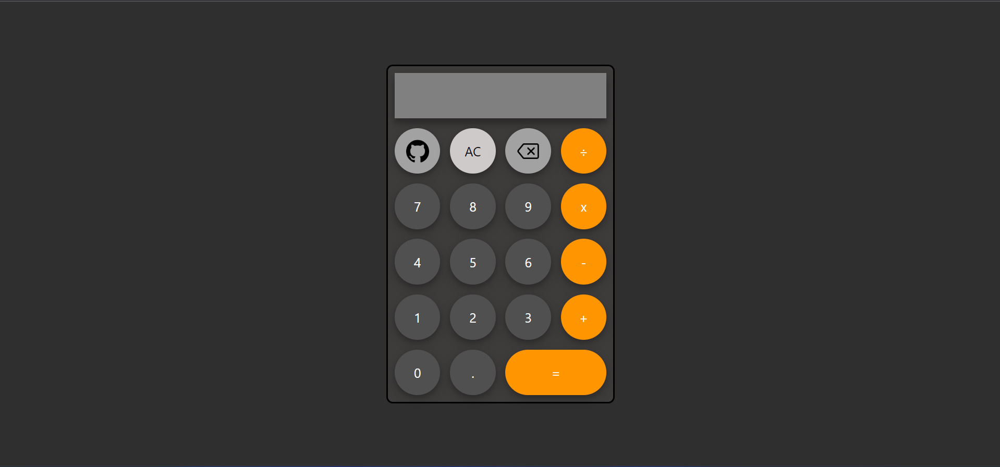

# Simple Calculator  🧮



This repository contains a simple calculator web application built using HTML, CSS, and JavaScript. The project was completed as part of TheOdinProject, a comprehensive online curriculum for learning web development.

The calculator allows users to perform basic arithmetic operations such as addition, subtraction, multiplication, and division. It provides a user-friendly interface with a number pad and buttons for various arithmetic operations.

---
## Installation
1. **Clone the repository:**

   ```bash
   git clone https://github.com/your-username/your-repo.git

2. **Navigate to the project directory:**
   
    ```bash
    cd Project-Calculator
3. **Open the calculator:**
     ```
     Locate the HTML file in the project directory 
    ```
---

#### Connect with me 🤝

Twitter: [@jfmartinz](https://twitter.com/jfmartinz)<br>
LinkedIn: [@jfmartinz](https://www.linkedin.com/in/jfmartinz/)<br>
Github: [@jfmartinz](https://github.com/jfmartinz)
